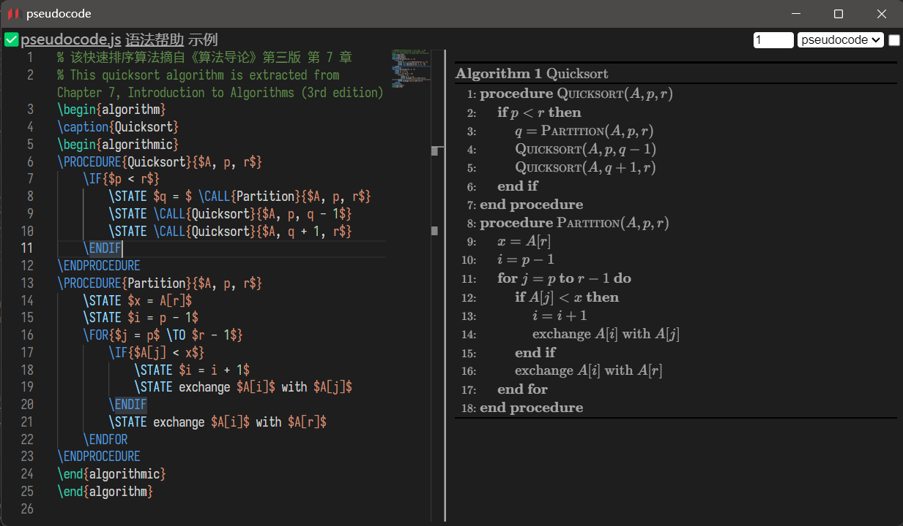

# widget-pseudocode

一个适用于思源笔记的 [pseudocode.js](https://saswat.padhi.me/pseudocode.js/) 挂件  
A [pseudocode.js](https://saswat.padhi.me/pseudocode.js/) widget for Siyuan Notes.

## 预览 | PREVIEW

## 功能 | FUNCTION

- 预览 | preview
  - 双击预览面板切换编辑/预览状态  
    Double-click the preview panel to toggle the edit/preview status.
- 编辑 | Edit
  - 使用快捷键 <kbd>Alt + Z</kbd> 开启/关闭自动换行功能  
    Use the shortcut <kbd>Alt + Z</kbd> to enable/disable word wrapping function.
  - 使用快捷键 <kbd>Ctrl + P</kbd> 切换至预览状态  
    Use the shortcut <kbd>Ctrl + P</kbd> to toggle to preview state.
  - 使用快捷键 <kbd>Ctrl + S</kbd> 保存当前编辑区内容  
    Use the shortcut <kbd>Ctrl + P</kbd> to save the content of the current editing area.
- 导出 | Export
  - 在笔记中导出为 HTML 或 PDF 时保留渲染后的样式  
    Preserves the rendered style when exporting to HTML or PDF in notes.
- 分享 | Share
  - 编辑模式中使用快捷键 <kbd>Ctrl + Shift + S</kbd> 复制分享链接  
    Use the shortcut <kbd>Ctrl + P</kbd> to copy the share link in edit mode.

## 依赖 | DEPENDENCIES

| 作者 \| Author                                    | 项目 \| Project                                                           | 许可证 \| License                                                                 |
| :------------------------------------------------ | :------------------------------------------------------------------------ | :-------------------------------------------------------------------------------- |
| **[Microsoft](https://github.com/microsoft)**     | [microsoft/monaco-editor](https://github.com/microsoft/monaco-editor)     | *[MIT License](https://github.com/microsoft/monaco-editor/blob/main/LICENSE.txt)* |
| **[SaswatPadhi](https://github.com/SaswatPadhi)** | [SaswatPadhi/pseudocode.js](https://github.com/SaswatPadhi/pseudocode.js) | *[MIT license](https://github.com/SaswatPadhi/pseudocode.js/blob/master/LICENSE)*                  |

注: 按引入时间排序

## 更改日志 | CHANGE LOG

[CHANGE LOG](./CHANGELOG.md)
